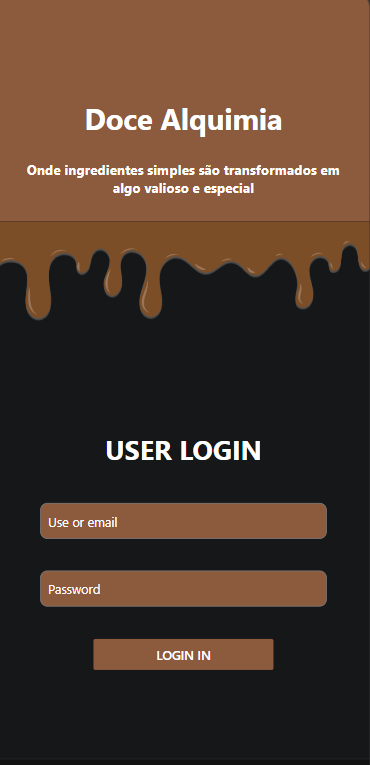
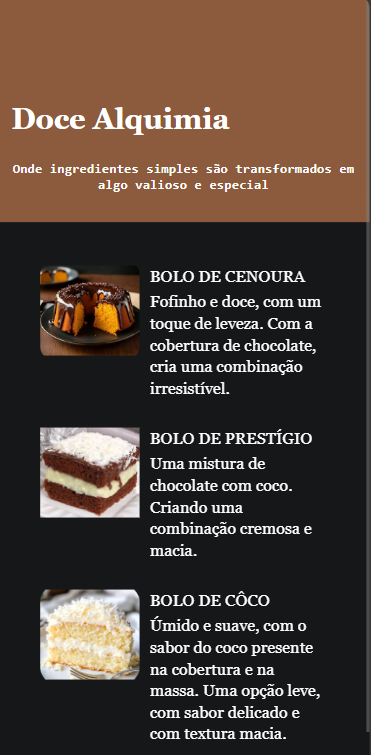

# projeto-backend-1tri-marial

# Integrantes do grupo 
## Integrantes do grupo
- Bianca Amorim N. 2  
- Kamilly Lacerda N. 16  
- Maria Luiza P N. 21

# Protótipo do Figma 
 https://www.figma.com/design/JgezY69buXCaMDOsoS013v/Site-de-Receitas?node-id=0-1&t=HbE1X56RDC3e34rl-1

 # Sobre o site 
Este é um site sobre receitas de bolos. 
Foi feito com o objetivo de mostrar as receitas de bolo, uma 
breve descrição e a possibilidade de adicionar sua própria receita. 

# Tecnologias usadas
- Figma (prototipagem)
- Github
- Python
- Postman
- React Native

# Páginas 
## Primeira tela (Tela de login) Maria Luiza
### Descrição
- Está é a primeira página, a tela inicial do site Doce Alquimia, onde o usuário pode acessar sua conta, para entrar no site e ver as receitas postadas e adicionar novas receitas. 

## Observações 
- Os campos de escrita são funcionais e o acesso ao site, é por meio do botão "Login in", localizado no final da página. 

## Dificuldades/Problemas durante o projeto 
- A dificuldade principal foi para adicionar e arrumar a imagem da calda, pois ela estava ficando muito desregular.
- Outros problemas foram os campos de escrita, "user" e "password", por alguns erros meus, a escrita desaparecia, o campo ainda funcionava, porém a escrita não aparecia quando digitada. 

## Solucões para os problemas
- Para solucionar a dificulade que eu tive com a imagem, eu tive que adicionar estilos inline diretamente dentro do componente. 
- O erro no campo de escrita foi bobo. A escrita desaparecia pois a cor dela estava da mesma cor do fundo da "caixa", e eu demorei para perceber isso. 

## Imagem da página

# Segunda tela (Tela de receita)
### Descrição 
- Está é a segunda página do site, a tela onde as receitas dos bolos estão. O usuário pode olhar nesta tela, fotos dos bolos e uma breve descrição. 

## Observações 
- O botão para a página seguinte, onde conseguira adicionar novas receitas está no final da página. 

## Dificuldades/Problemas durante o projeto
- A principal dificuldade foi adicionar o botão que iria para a página de 'adicionar receitas'. 
- Uma outra dificuldade foi colocar as imagens de bolo e as descrições uma embaixo da outra. Pois uma hora as imagens ficavam desproporcionais, e outras, as descrições ficavam confusas. 

## Soluções para os problemas
- Para a resolução do erro que estava dando no botão, eu tive que refazer o import, pois estava errado. 
- As imagens eu tive que colocar a parte do "row" para que eu conseguisse deixar eles no centro.  

## Imagem da página 

# Terceira tela 

##

